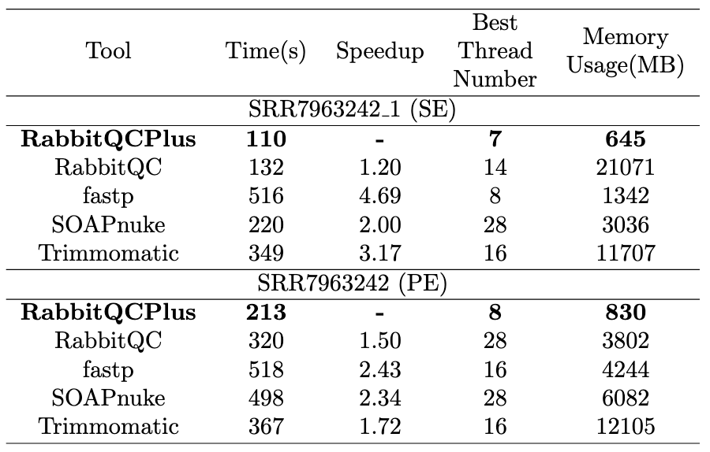
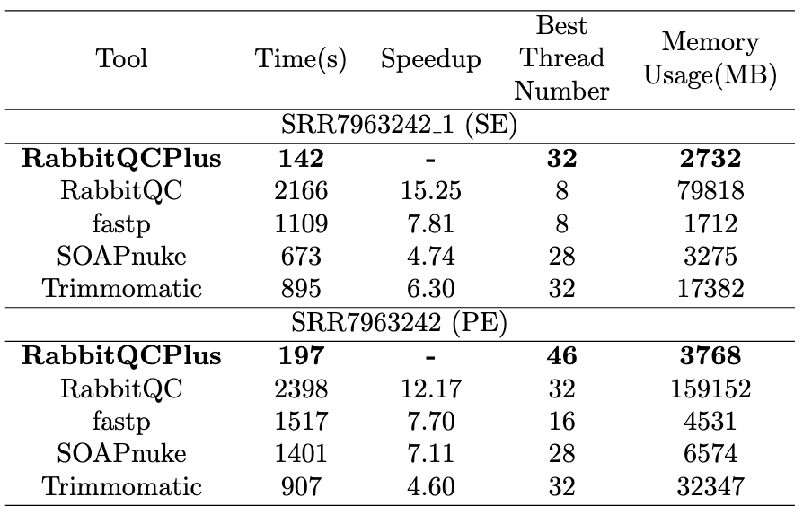
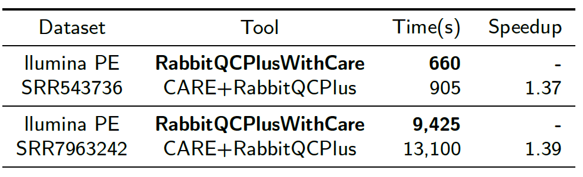

[](https://anaconda.org/bioconda/rabbitqcplus)
[](https://anaconda.org/bioconda/rabbitqcplus)
[](https://anaconda.org/bioconda/rabbitqcplus)
[](https://anaconda.org/bioconda/rabbitqcplus)
[](https://anaconda.org/bioconda/rabbitqcplus)


## 

# RabbitQCPlus 2.0 Features

A modern quality control tool for sequencing data.
- Single-threaded performance is improved by a factor of 2 at least.

- Solving the performance issues when processing gz files (more than 4x speedups compared with SOAPnuke).

- Improving the efficiency of the time-consuming over-representation module by a factor of 5.

- Integrated and optimized the CARE error correction engine, achieving a speedup of 1.3 times.

# Installation

RabbitQCPlus can only support 64-bit Linux Systems.

## Bioconda

RabbitQCPlus is available from [Bioconda](https://bioconda.github.io/).

[Setup bioconda](http://bioconda.github.io/#usage)

```bash
conda create -n rabbitqcplus rabbitqcplus

conda activate rabbitqcplus
```

It's important to note that the version on Bioconda uses the SSE4.2 instruction set for automatic vectorization to enhance robustness, which may lead to a performance trade-off. For optimal performance, compiling from the source code is recommended.

## From source

### Dependancy

- gcc 9.4.0 or newer
- [zlib](https://zlib.net/)

### Compilation

```bash
git clone https://github.com/RabbitBio/RabbitQCPlus.git
cd RabbitQCPlus
make -j4
```
To improve the robustness of the software, we have implemented different software versions for different vectorized instruction sets. RabbitQCPlus can automatically detect the system CPU instruction set and compiler version at compile time to select the appropriate software version.

You can also specify the instruction set you want to use by manually modifying the ``InstructSet`` in the ``Makefile``. ``-DVec512`` means using the avx512 instruction set, and ``-DVec256`` means using the avx2 instruction set; otherwise, let the compiler choose.

# Simple usage

## For next generation sequencing data

- For SE (not compressed)

```bash
./RabbitQCPlus -w 8 -i in1.fastq -o p1.fastq
```

- For SE (gzip compressed)

```bash
./RabbitQCPlus -w 8 -i in1.fastq.gz -o p1.fastq.gz
```

- For PE (not compressed)

```bash
./RabbitQCPlus -w 8 -i in1.fastq -I in2.fastq -o p1.fastq -O p2.fastq
```

- For PE (gzip compressed)

```bash
./RabbitQCPlus -w 16 -i in1.fastq.gz  -I in2.fastq.gz -o p1.fastq.gz -O p2.fastq.gz
```

- For SE (use CARE engine to correct errors)

```bash
./RabbitQCPlus -w 32 -i in1.fastq -o p1.fastq --correctWithCare --coverage 30 --pairmode SE
```

- For PE (use CARE engine to correct errors)

```bash
./RabbitQCPlus -w 32 -i in1.fastq -I in2.fastq -o p1.fastq -O p2.fastq --correctWithCare --coverage 30 --pairmode PE
```


## For third generation sequencing data

- not compressed

```bash
./RabbitQCPlus -w 4 -i in.fastq --TGS
```

- gzip compressed

```bash
./RabbitQCPlus -w 6 -i in.fastq.gz --TGS
```

# Options

For more help information, please refer to `./RabbitQCPlus -h`.


# Performance results

Experiments have been conducted on a Linux server with 2 Intel Xeon Platinum 8260 CPUs, 1.5T RAM, 2T SSD, running Ubuntu 20.04 and GCC9. We have compared the performance of RabbitQCPlus with RabbitQC (v0.0.1), fastp (v0.23.2), SOAPnuke (v2.1.7), Trimmomatic (v0.40), CARE (v2.0.0, CPU version) and FASTQC (v0.11.9) using 370 million Illumina sequencing reads ([SRR7963242](https://www.ncbi.nlm.nih.gov/sra/?term=SRR7963242)).

We use default parameters of each application except for the number of threads on both plain and gzip-compressed FASTQ files.
When using default parameters, RabbitQCPlus performs the same or more comprehensive quality control operations compared to other applications.

## Plain FASTQ files



## Gzip-compressed FASTQ files



## With error correction module on



# Visual output

We visualized the information before and after data filtering, and [here](https://yanlifeng.github.io/someTest/example.html) is an example.

# Citation
Lifeng Yan, Zekun Yin, Hao Zhang, Zhan Zhao, Mingkai Wang, André Müller, Felix Kallenborn et al. "RabbitQCPlus 2.0: More efficient and versatile quality control for sequencing data." Methods 216 (2023): 39-50.

Lifeng Yan, Zekun Yin, Hao Zhang, Zhan Zhao, Mingkai Wang, André Müller, Robin Kobus, Yanjie Wei, Beifang Niu, Bertil Schmidt, Weiguo Liu. "RabbitQCPlus: More Efficient Quality Control for Sequencing Data," *2022 IEEE International Conference on Bioinformatics and Biomedicine (BIBM)*, Las Vegas, NV, USA, 2022, pp. 619-626, doi: 10.1109/BIBM55620.2022.9995332.

Zekun Yin, Hao Zhang, Meiyang Liu, Wen Zhang, Honglei Song, Haidong Lan, Yanjie Wei, Beifang Niu, Bertil Schmidt, Weiguo Liu, RabbitQC: High-speed scalable quality control for sequencing data, Bioinformatics, , btaa719, https://doi.org/10.1093/bioinformatics/btaa719
